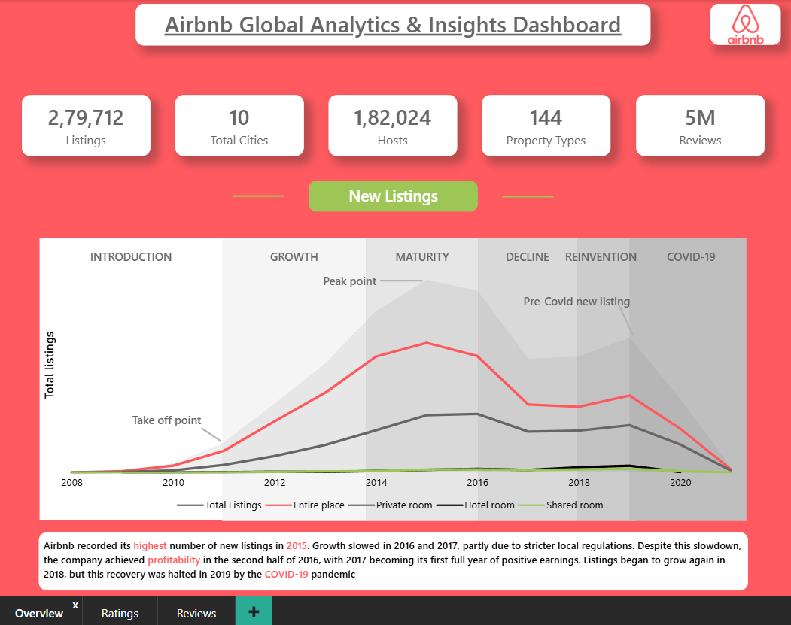
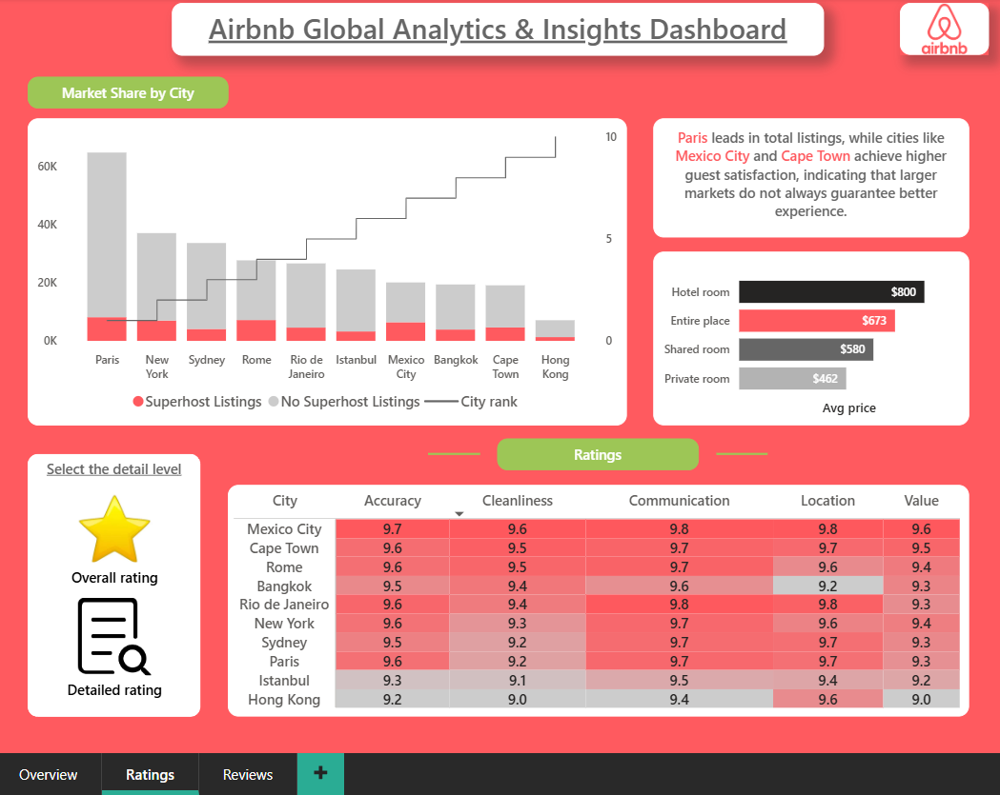
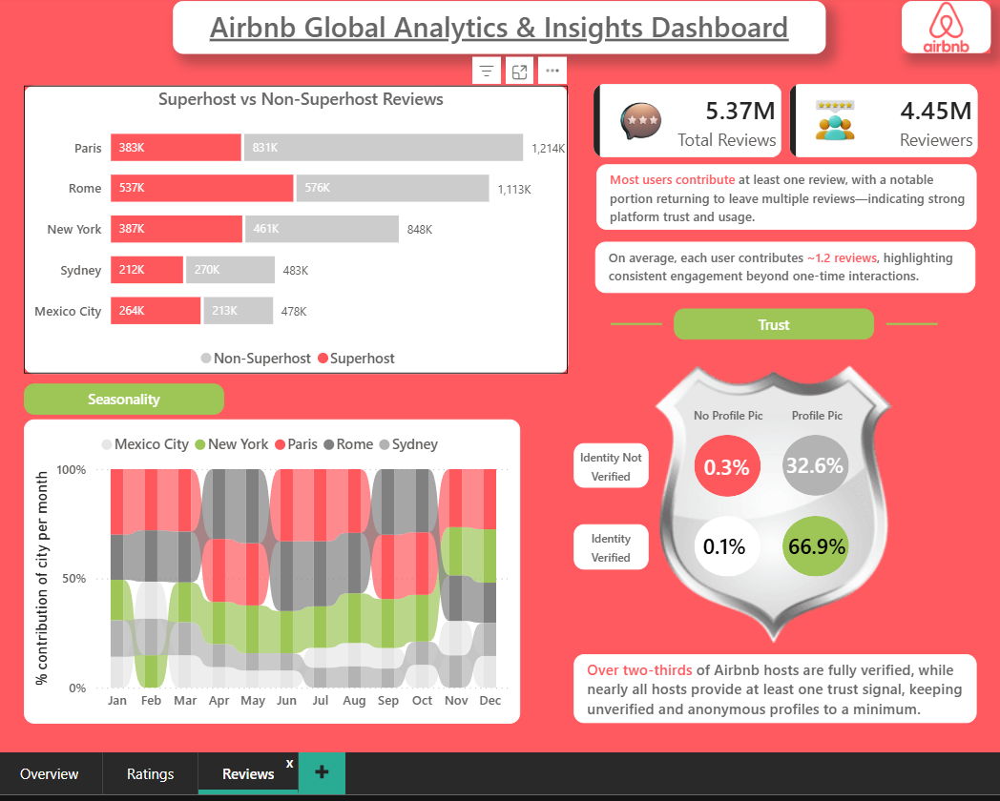

# 🏡 Airbnb Global Analytics & Insights Dashboard  

An interactive **Power BI dashboard** analyzing Airbnb listings, reviews, pricing, and customer satisfaction across major global cities.

---

## 📌 Short Description  

The **Airbnb Global Analytics & Insights Dashboard** provides a comprehensive view of listing distribution, pricing trends, guest reviews, and host trust metrics.

It enables users to explore how different cities perform in terms of **market size, pricing, guest satisfaction, and engagement**, helping uncover key patterns in the short-term rental market.

---

## 🛠️ Tech Stack  

- 📊 Power BI Desktop – Data visualization & dashboard design  
- 🔄 Power Query – Data cleaning and transformation  
- 🧠 DAX (Data Analysis Expressions) – Measures and KPIs  
- 🔗 Data Modeling – Relationship between listings & reviews  
- 📁 File Format – `.pbix`  

---

## 📂 Data Source  

Airbnb dataset containing:

- Listings data (~200K rows)  
- Reviews data (~5M+ rows)  
- City-level information (10 major cities)  
- Room types (Entire home, Private room, Shared room, Hotel room)  
- Host details (Superhost, verification, profile info)  
- Pricing and ratings  

---

## 🚀 Features & Highlights  

### 🔎 Business Problem  

Airbnb operates across multiple cities with varying supply, pricing, and customer satisfaction levels. Raw data makes it difficult to identify:

- Which cities dominate the market  
- Whether higher prices lead to better experiences  
- How host trust impacts guest satisfaction  
- Seasonal and engagement patterns  

---

### 🎯 Goal of the Dashboard  

To build an interactive dashboard that:

- Analyzes market share across cities  
- Compares pricing across room types  
- Evaluates guest satisfaction (ratings)  
- Measures user engagement (reviews & reviewers)  
- Assesses host trust indicators  

---

## 📊 Key Visuals Overview  

### 📌 KPI Cards  
- **Total Listings:** 279K  
- **Total Cities:** 10  
- **Total Hosts:** 182K  
- **Property Types:** 144  
- **Total Reviews:** 5M+  

---

## 📈 Business Insights  

- Market leaders (**Paris, New York**) dominate supply but don’t always lead in satisfaction  
- Emerging cities (**Mexico City, Cape Town**) outperform in guest experience  
- Higher price ≠ better ratings, indicating value opportunities  
- Strong user engagement, with repeat reviews per user  
- Trust signals (verification, profile completeness) play a key role in platform reliability  

---

## 🎓 Learning Outcome  

This project demonstrates:

- Advanced data modeling with large datasets (5M+ rows)  
- Writing efficient DAX measures  
- Designing story-driven dashboards  
- Creating business insights from raw data  
- Building interactive and visually appealing reports  

---

## 📸 Dashboard Preview  

### 🔹 Overview  

### 🔹 Ratings  

### 🔹 Reviews  

---
